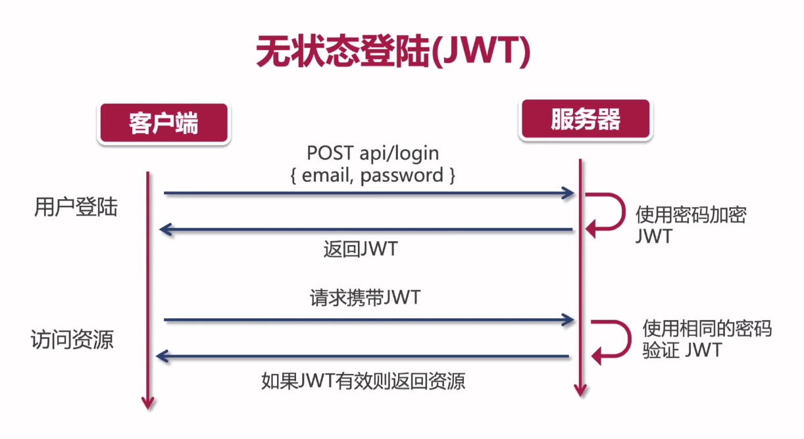
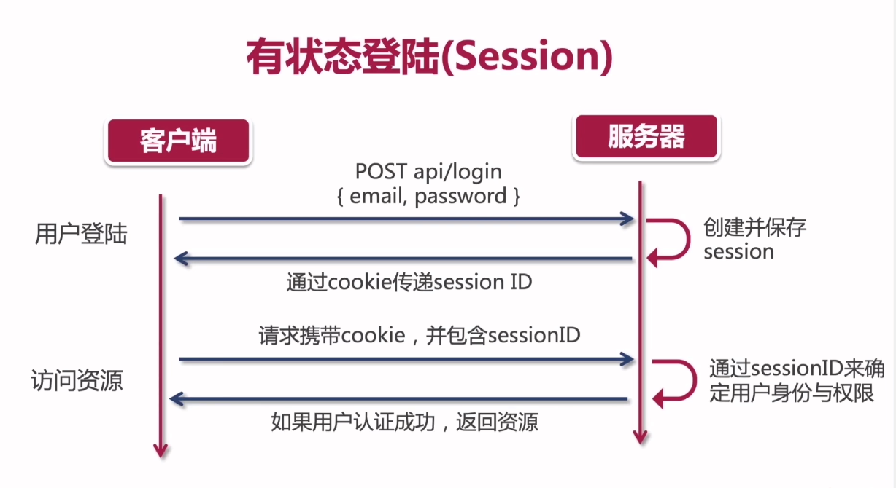
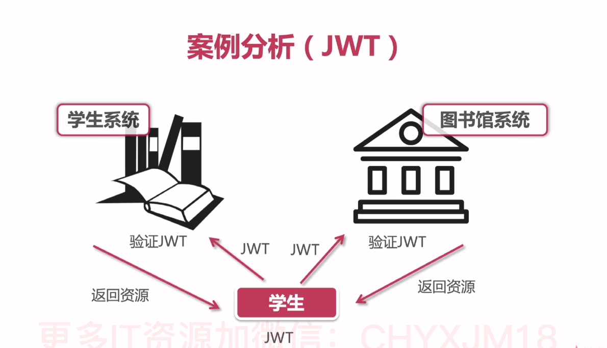

## 问题

1. 执行 yarn lint:fixe. 报错`error Parsing error: Must use import to load ES Module...`

原因： node 版本过高。解决：package.json 中加`"type": "module"`

依然报错：`Error [ERR_REQUIRE_ESM]: Must use import to load ES Module: D:\home\projects\react-ts-ds\.eslintrc.js`

- 去掉 package.json 加的；
- package.json 中 babel-eslint 改为@babel/eslint-parser
- .eslintrc.js 中 babel-eslint 改为@babel/eslint-parser
- .eslintrc.js 中加`requireConfigFile: false,`

## 登录注册

### 单点登录与 [JWT](https://jwt.io)

**JWT:**

- JSON Web Token
- 作用是用户*授权*，而不是用户的身份*认证*
- 用户认证指的是使用用户名、密码来验证当前用户的身份（用户登录，401 Unauthorized 未授权）
- 用户授权指的是当前用户有足够的权限访问特定的资源（403 forbidden 禁止访问）
- 替换 cookie,无状态登录（分布式部署）
- jwt 信息只需要保存在客户端
- 无状态，token 一经发布无法取消（无解）
- 明文传递，token 安全性低（https）



**传统 Session:**

- 用户登录后，服务器会保存登录的 session 信息
- Session ID 会通过 cookie 传递给前端
- http 请求会附带 cookie
- 有状态登录



### 单点登录系统（SSO）

- 企业级的付费框架 ForgeRock, 微软的 Micriosoft AM
- 开源的 OpenAM, OpenIDM, OpenDJ



## 规范化

[如何配置 Git Commit Message](https://zhuanlan.zhihu.com/p/69635847)

#### 编辑器规范

#### 代码格式规范

#### js 及 react 代码语法规范

#### commit 提交规范

1. commitizen/cz-cli： 替代你的 git commit（帮助我们生成符合规范的 commit message）

- 全局安装：npm install commitizen -g // git cz | git-cz 代替 git commit
- 项目中安装：

  > npm i commitizen -D;

  package.json 中配置 scipt 命令："commit": "git-cz"。npm run commit 代替 git commit

- 无需安装：npx cz; (npm 5.2+)

2. cz-customizable：自定义 adapter, 可自定义的 Commitizen 插件。比如：默认的提交 types 可能特别多，有些时候我们可能只需要其中的某些 type，或者自定义 type。（或者使用 cz-conventional-changelog。一个 commitizen 的 adapter（适配器），一个符合 Angular 团队规范的 preset。按照我们指定的规范帮助我们生成 commit message。）

> yarn add cz-customizable -D

配置 package.json:

```
{
    "config": {
        "commitizen": {
          "path": "node_modules/cz-customizable"
        }
    }
}
```

根目录，配置.cz-config.js

3. commit 校验

如果是使用 cz-customizable 适配器做了破坏 Angular 风格的提交说明配置，那么不能使用@commitlint/config-conventional 规则进行提交说明校验，可以使用 commitlint-config-cz 对定制化提交说明进行校验。

> yarn add -D commitlint-config-cz @commitlint/cli

配置`.commitlintrc.js` 文件：

```
module.exports = {
  extends: [
    'cz'
  ]
}
```

4. 通过 git hook 在 commit-msg 阶段进行 commit message lint。

> npx husky add .husky/commit-msg 'npx --no-install commitlint --edit $1'

#### 版本管理及日志规范
